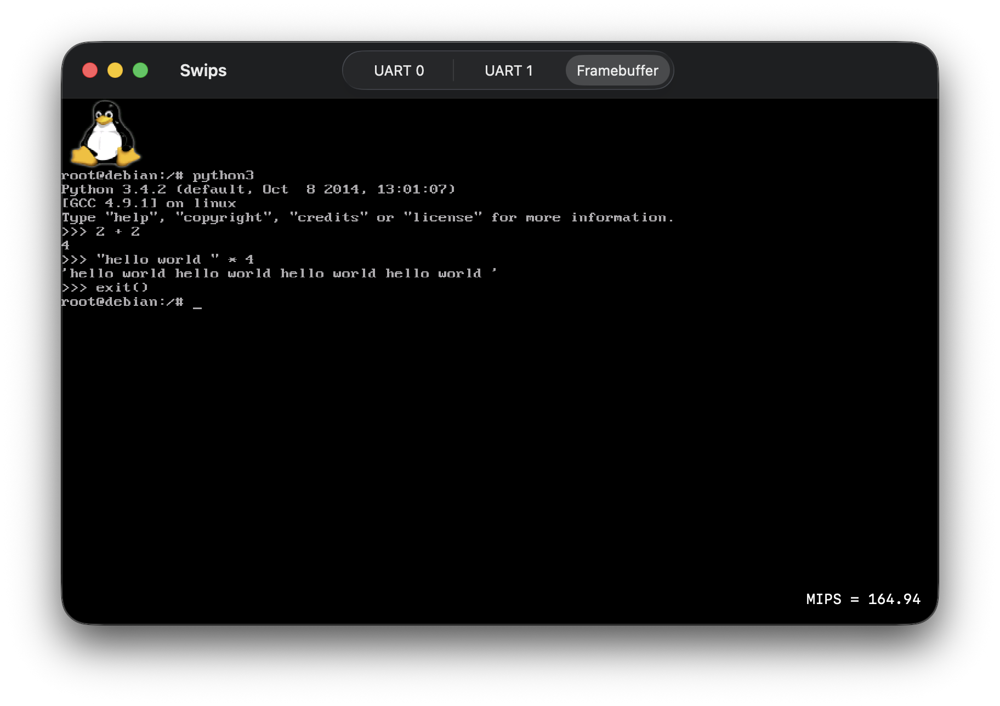
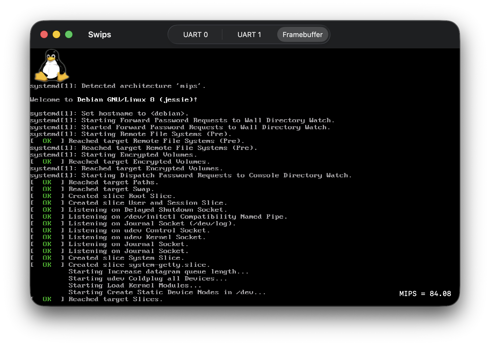
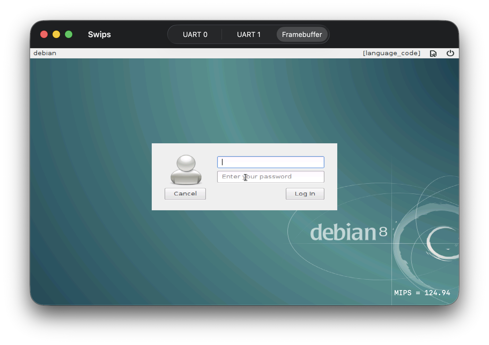
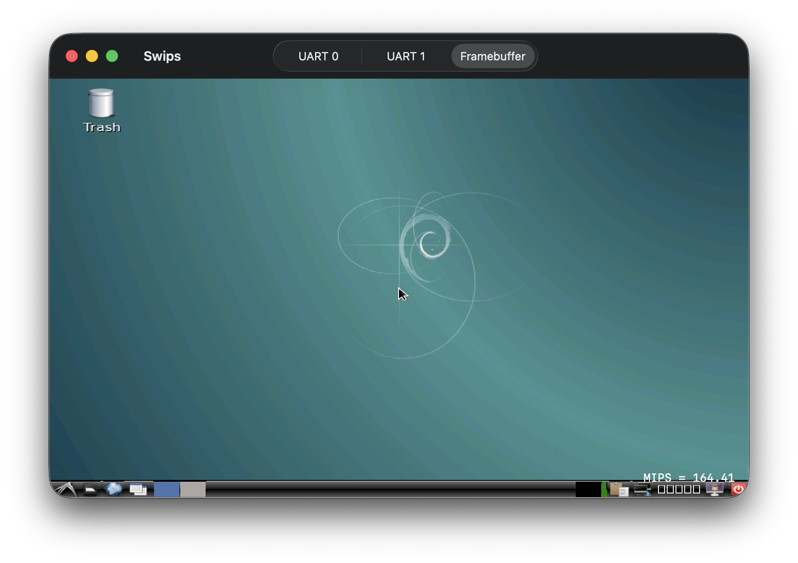

# Swips

**/swɪps/** - a portmanteau of **Sw**ift and M**IPS**.

**A from-scratch MIPS full-system emulator written in Swift that boots Linux to the desktop.**

~2,500 lines of Swift. No emulation libraries. No QEMU.

## Why

This started as an exercise in understanding how computers actually work below the operating system - how a CPU pipeline handles branches, how the TLB mediates virtual and physical memory, how an interrupt propagates from a UART chip all the way into a kernel handler. Writing it in Swift (a modern, safe, expressive language) made the code readable without sacrificing enough performance to boot Linux in a reasonable amount of time.

**It is probably the smallest self-contained codebase capable of booting Linux to a full desktop session.**

## What it does

Swips is a multiplatform SwiftUI app (macOS, iOS, iPadOS) that implements a complete MIPS system from the ground up - CPU, coprocessors, MMU, interrupts, and a set of virtual hardware devices - and uses it to boot an unmodified Linux kernel. With a raw Debian disk image it boots all the way to a full desktop session under systemd. Without one, the bundled initrd drops you into a BusyBox shell.

There is no JIT, no binary translation, and no dependency on any emulation framework. Everything - instruction decode, TLB, exception handling, device I/O - is implemented directly in Swift.

## Features

### CPU
- Custom minimal MIPS I/II core loosely based on R3000A
- Full 32-bit integer instruction set: arithmetic, logic, shifts, multiply/divide, loads/stores, branches, traps
- Branch delay slots, likely branches
- `SYSCALL`, `BREAK`, `SYNC`

### Coprocessor 0 (System Control)
- Full CP0 register bank with hardware timer (Count/Compare) and interrupt
- 64-entry software-managed TLB with hash cache for fast lookups
- Complete virtual address space: `kuseg`, `kseg0`, `kseg1`, `kseg2`
- Full exception model: interrupts, TLB miss/modification, syscall, breakpoint, reserved instruction, overflow, traps, coprocessor unusable

### FPU (Coprocessor 1)
- Single and double precision arithmetic, rounding, comparisons, conversions
- FPU load/store and branch instructions

### Hardware Devices

| Device | Address | Notes |
|---|---|---|
| RAM | `0x00000000` | 256 MB |
| ROM | `0x1FC00000` | 16 MB, reset vector |
| UART 0 | `0x10030000` | 8250-compatible serial |
| UART 1 | `0x10030100` | 8250-compatible serial |
| PS/2 Keyboard | `0x10040000` | Full scancode translation |
| PS/2 Mouse | `0x10040100` | Relative movement |
| Block Device | `0x11000000` | DMA, sector-based, backed by `debian.img` |
| Framebuffer | `0x1A000000` | 800×600, RGB565 |

### UI
- SwiftUI app with three tabs: **UART 0**, **UART 1**, **Framebuffer**
- Terminal emulator powered by [SwiftTerm](https://github.com/migueldeicaza/SwiftTerm) for serial console output
- Live MIPS (million instructions per second) throughput counter (bottom-right corner)
- Keyboard and mouse pass-through to the guest when the Framebuffer tab is active

## Screenshots

|  |  |
|---|---|
|  |  |

## Performance

On M1 Pro, Swips sustains around **~160 million instructions per second**, fully interpreted - no JIT, no tricks. That's fast enough to get you to a Linux desktop in a reasonable amount of time.

## Shortcomings

This is a hobby project and has real rough edges:

- There are known bugs - some Linux workloads may trigger incorrect behavior
- No RTC (real-time clock) - the guest has no sense of wall time
- It might crash for you, especially with unusual disk images or kernel configs
- Missing some less-common MIPS instructions and CP0 edge cases

## Getting started

### Build

Clone the repo and double-click `Swips.xcodeproj`. Build and run the `Swips` scheme - the app will immediately start executing the bundled kernel.

### Runtime files

The `runtime/` directory (bundled inside the app) contains:

| File | Description |
|---|---|
| `vmlinuz.systemd.bin` | Kernel configured enough to get you to the desktop |
| `vmlinuz.bin` | Minimal Linux kernel |
| `initrd` | BusyBox initrd - boots to a shell without a disk image |
| `debian.img` | **Not included** - raw Debian disk image (see below) |

### Booting to BusyBox (no setup needed)

Just build and run. The emulator loads the bundled kernel and initrd and drops into a BusyBox shell on **UART 0**.

### Booting to the full Debian desktop

1. Obtain or create a raw Debian MIPS (little-endian, o32 ABI) disk image.
2. Place it at `runtime/debian.img` inside the app bundle (or copy it next to the binary where the bundle resolver can find it).
3. The disk image size must be a multiple of 4096 bytes.
4. Build and run. The disk image is mounted automatically at `/debian`; hand off to systemd with `exec /sbin/init`.

> **Note:** The `debian.img` disk image is **not included** in this repository due to its size. You need to provide your own raw Debian MIPS image.

## Linux kernel patch

The `patches/linux.patch` file adds a `MACH_SWIPS` machine target to the Linux 5.14.2 kernel source tree. It registers the Swips hardware map (UART, framebuffer, PS/2, block device) so the kernel can discover and drive the virtual hardware without any custom drivers beyond the standard Linux MIPS platform glue.

## License

MIT - see individual source files for copyright notices.
